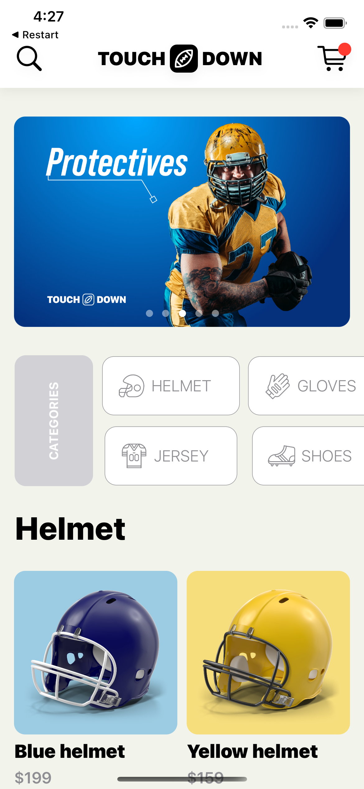
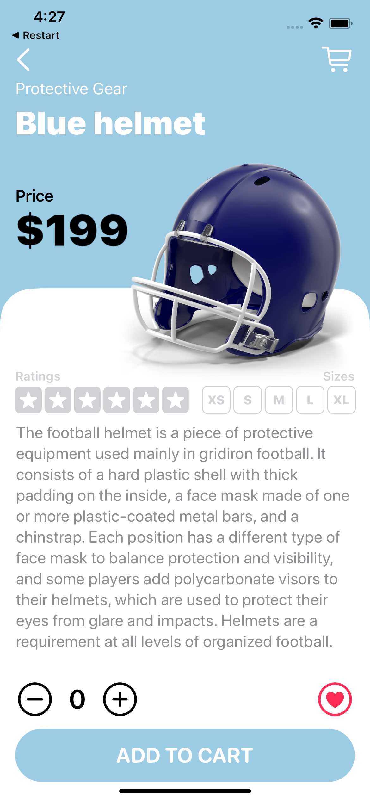
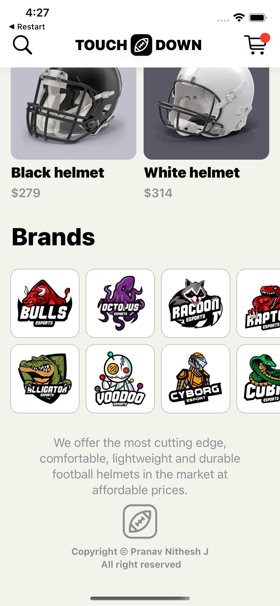

# LabKart_SwiftUI

---

<h2> 
  Full featured eCommerce like app written in SwiftUI.
</h2>

  
  
  

---

<h2>
  Features
</h2>

- Home Page lists the categories
- Banner in the home page.
- List of Brands.
- Product detailo page..

---

<h2>
  Notes
</h2>

 Use of JSON data stored locally to get product details.

---

<h2>
  Watch Full Video
</h2>

<a href="https://drive.google.com/file/d/1qIlh6ABC-eMLaGblEuDUb0QwYAu7orfb/view?usp=drivesdk"> Click here to Watch the full Functionality. </a>

---
